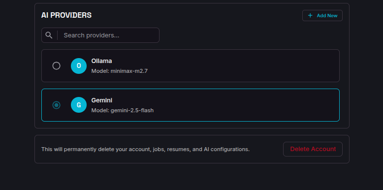
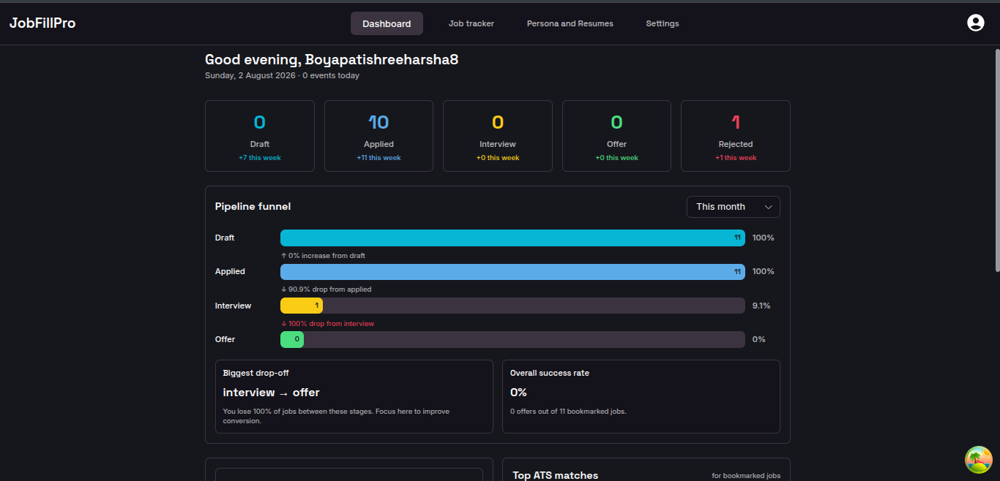
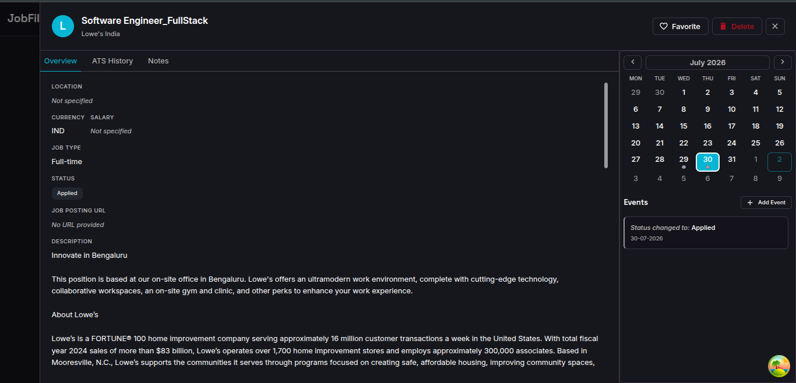
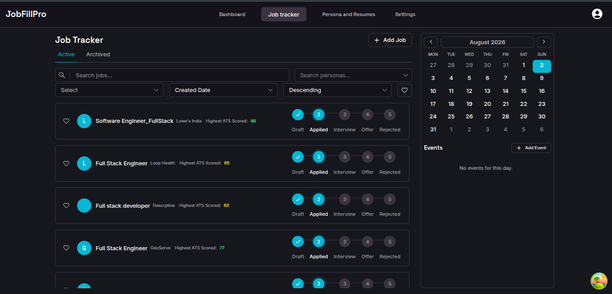
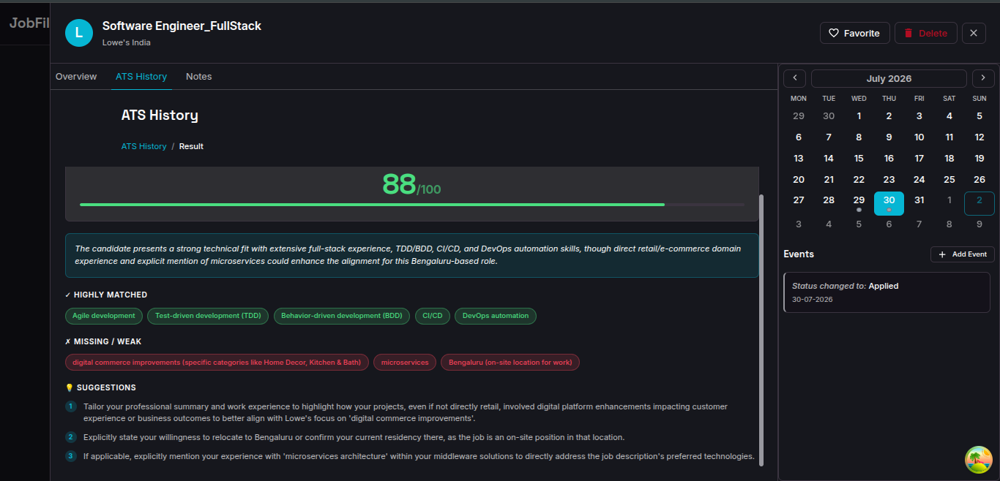
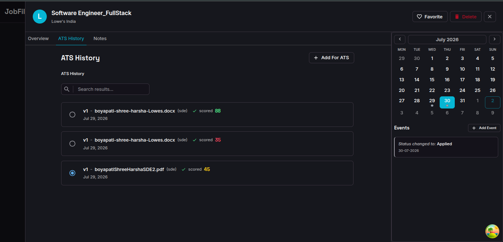
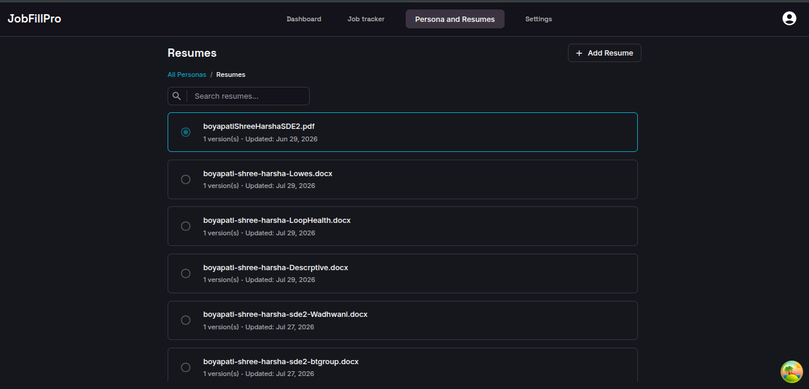

# Job Filler Project (JFP)

A full-stack monorepo project I built to deepen my skills across backend, frontend, browser extension, DevOps, and AI integration. It helps job seekers select the best-suited resume for a role, extract job details with one click, and track the application lifecycle — while serving as a practical showcase of the engineering decisions and patterns I applied end-to-end.

---

## Table of Contents

- [What I Built](#what-i-built)
- [Screenshots](#screenshots)
- [Engineering Decisions & Learnings](#engineering-decisions--learnings)
- [Monorepo Structure](#monorepo-structure)
- [Tech Stack](#tech-stack)
- [Getting Started](#getting-started)
- [Available Scripts](#available-scripts)
- [Database Migrations](#database-migrations)
- [Environment Variables](#environment-variables)
- [License](#license)

---

## What I Built

JFP streamlines the job-application workflow in four pillars:

1. **One-click job extraction** — A Chrome extension (Manifest V3) scrapes job postings from Naukri, parsing JSON-LD structured data and saving it to the backend.
2. **AI-powered resume analysis** — Users configure their preferred AI provider (OpenAI, Anthropic, Google, Custom OpenAI provider). The backend scores resumes against a job description and returns actionable improvement suggestions.
3. **Portfolio management** — Users create portfolios (e.g. _Full-Stack_, _Frontend_, _Backend_) and manage multiple resume versions, compare them side-by-side, and pick the best fit.
4. **Application tracking** — A dashboard to track applied jobs, interview schedules, statuses, notes, calendar events, and weekly goals — with infinite scroll and pagination for large lists.

---

## Screenshots

### Configuration — AI Provider Settings



### Dashboard — Application Tracking Overview



### Job Info — Extracted Job Details



### Job Tracker — Application Pipeline



### Resume Analysis — AI Score & Suggestions



### Result — ATS Analysis Report



### Resume — Portfolio & Resume Versions



---

## Learnings

This section highlights the engineering choices, patterns, and problem-solving that went into this project. **These are the skills and experiences I want to showcase.**

### Architecture & Monorepo

- **pnpm workspaces + Turborepo** — Structured the project as a monorepo with three apps (`backend`, `web`, `extension`) and shared packages (`shared-types`, `ui`, `assets`, `eslint-config`, `stylelint-config`, `typescript-config`, `utils`). Turborepo manages the build pipeline with dependency-aware task ordering and caching.
- **Shared TypeScript types** — Created a `@repo/shared-types` package so the backend, web app, and extension all import the same API contracts. This eliminated drift between frontend and backend and caught contract mismatches at compile time.
- **Shared ESLint, Stylelint, and tsconfig packages** — Centralized tooling configs so every app follows the same linting and type-checking rules with zero duplication.

### Backend Design

- **Express 5 REST API with layered architecture** — Controllers handle HTTP, services contain business logic, and TypeORM repositories manage persistence. Zod validates every request body and query at the controller boundary before it reaches the service layer.
- **TypeORM migrations** — Used a migration-first workflow (`db:generate`, `db:migrate`, `db:revert`) instead of `synchronize: true`, ensuring schema changes are versioned, reviewable, and safe for production.
- **Helmet.js** — Hardened HTTP headers (CSP, HSTS, etc.) to reduce common attack surface.
- **Rate limiting** — `express-rate-limit` protects auth and AI endpoints from abuse.
- **Pino structured logging** — Replaced `console.log` with Pino + `pino-http` for high-throughput, JSON-formatted request logs that are easy to ship to a log aggregator.
- **WebSocket (ws) real-time** — Built a WebSocket server alongside the REST API for real-time updates (e.g. job status changes, AI analysis progress) to the web app and extension.

### Authentication & Security

- **Google OAuth 2.0 + JWT** — Implemented the full OAuth flow: client redirects to Google, backend exchanges the code for tokens, verifies the ID token, and issues a JWT session cookie. Configurable expiry via `NODE_JWT_EXPIRES_IN`.
- **Email code verification** — As an alternative to OAuth, implemented a code-by-email flow using Nodemailer + Gmail SMTP. A random code is generated, emailed, and verified server-side — no password storage needed.
- **Data encryption in transit** — Sensitive payloads (e.g. API keys) are encrypted with AES-128-GCM using `crypto-js` before being sent between extension, web, and backend. The `TRANSIT_SECRET` passphrase is shared across clients.
- **Cookie security** — HTTP-only, same-site JWT cookies to mitigate XSS-based token theft.

### Browser Extension (Chrome MV3)

- **Manifest V3 architecture** — Service worker background, content scripts injected on supported job sites, and a side panel UI built with React + TanStack Router.
- **`@crxjs/vite-plugin`** — Set up Vite-based HMR for the extension, handling MV3-specific bundling quirks (service worker entry, content script injection, web-accessible resources).
- **JSON-LD parsing** — Discovered that job sites embed structured data in `<script type="application/ld+json">` tags for Google search. Parsed these to reliably extract job title, company, description, and location — far more stable than scraping raw HTML.
- **IndexedDB (idb)** — Used IndexedDB in the extension for offline persistence of drafts and queued saves, syncing to the backend when connectivity is restored.
- **Content script → service worker → backend** — Designed a message-passing pipeline: content script extracts data from the page, sends it to the service worker, which forwards it to the backend API.

### AI Integration

- **Factory pattern for AI providers** — Built a provider factory so OpenAI, Anthropic, Google, and Custom OpenAI provider all implement a common interface. Adding a new provider is a single registration — no changes to the controller or service layer.
- **Vercel AI SDK** — Used the SDK for streaming responses, token counting, and provider-agnostic message formatting, avoiding vendor lock-in at the application layer.
- **Resume scoring pipeline** — The backend sends a structured prompt (job description + resume content) to the selected provider, parses the response into a score + suggestions, and persists the result for comparison.

### Frontend Engineering

- **React 19 + Vite 7** — Built the web app and extension UI with React 19, leveraging concurrent features and the latest Vite for fast HMR and optimized production builds.
- **TanStack Router & Query** — Type-safe, file-based routing with TanStack Router; server-state management and caching with TanStack Query (including infinite scroll via `useInfiniteQuery`).
- **Zustand for client state** — Used Zustand for lightweight global UI state (e.g. sidebar, theme), keeping server state in TanStack Query and client state in Zustand — a clear separation that avoided context-bloat.
- **MUI 7 component library** — Built a shared `@repo/ui` package with MUI-based components (accordion, button, card, file uploader, autocomplete, etc.) reused across the web app and extension.
- **Monaco Editor** — Integrated Monaco for editing resume content with syntax highlighting.
- **Blob rendering for resumes** — Backend sends raw resume data (not a Blob, which gets stripped in JSON serialization). The client converts the raw data to a Blob, creates an object URL, and renders it in an iframe — a workaround for the browser security model.
- **Infinite scroll + pagination** — Implemented efficient list rendering for jobs and resumes using TanStack Query's `useInfiniteQuery` + Intersection Observer, keeping DOM nodes bounded.

### DevOps & Tooling

- **Git hooks (Husky + lint-staged + Commitlint)** — Pre-commit runs ESLint + Prettier on staged files; commit messages are validated against Conventional Commits. This caught issues before they reached CI.
- **Docker & Docker Compose** — Wrote a multi-service `docker-compose.yml` (PostgreSQL + backend) with health checks, dependency ordering, and a separate `docker-compose.prod.yml` for production. Backend Dockerfile uses multi-stage builds.
- **Nginx + Certbot** — Configured Nginx as a reverse proxy with TLS via Certbot for production deployments.
- **Vitest** — Set up unit tests for backend validation and business logic with Vitest, including mock data under `apps/backend/tests/mocks/`.

### Problem-Solving Highlights

- **Blob stripping in JSON** — Discovered that sending a Blob from the backend via JSON strips the binary data. The client-side `createBlob()` handler now supports three payload shapes the API can return: plain `text` (TXT), `file` as `number[]` (Buffer serialized to JSON → wrapped in `Uint8Array`), and `file` as a base64 string (stripped of `data:...;base64,` prefix, then decoded). The reconstructed Blob is assigned an object URL and rendered in an iframe — a workaround for the browser security model.

- **Extension ↔ backend auth** — The extension needs to authenticate against the same backend as the web app. Solved by sharing the JWT cookie domain and OAuth client configuration, with the extension using `chrome.identity` for the OAuth flow. The backend issues the same JWT regardless of client, so a session started in the extension is valid in the web app and vice versa.

- **Real-time sync across extension and web** — Both the extension and web app subscribe to the same WebSocket, so a job saved from the extension instantly appears in the web dashboard. Implemented a heartbeat/ping-pong mechanism to detect stale connections and auto-reconnect with backoff.

- **JWT algorithm confusion attack prevention** — Pinned `algorithms: ['HS256']` on every `verifyToken` call to prevent an attacker from forging a token signed with `none` or an asymmetric RS256 key against the public secret. Added production fail-loud secret validation — `getJwtConfig()` throws if `NODE_JWT_SECRET` is shorter than 32 characters in production but only warns in dev.

- **JWT error differentiation** — `verifyToken` distinguishes `TokenExpiredError` (returns a "token expired" message so the client can transparently refresh) from `JsonWebTokenError` (returns "invalid token" so the client forces re-login), enabling a smoother UX.

- **Scraper registry + strategy pattern with generic fallback** — Built an ordered scraper registry (`naukri → linkedin → indeed → generic`). `getScraper(url)` picks the first matching `canHandle()`; the generic scraper's `canHandle()` always returns `true`, guaranteeing a result. If a site-specific scraper crashes, `scrapeCurrentPage` catches the error and returns a minimal `ScrapedJob` with `platform: 'error'` so the form still opens with the URL — the user is never left with a blank screen.

- **JSON-LD parsing with site-specific fallback** — Job sites embed structured data in `<script type="application/ld+json">` tags for Google search. I parse JSON-LD first (scanning multiple blocks for `@type: "JobPosting"`), then fall back to site-specific DOM selectors if JSON-LD is absent or malformed — far more stable than scraping raw HTML alone.

- **AI provider factory with OpenAI-compatible reuse** — The factory maps Groq to `createOpenAI` with a Groq `baseURL`, Ollama to `createOpenAI` with a dummy API key (the SDK contract requires one) plus a user-supplied `customBaseUrl`, and "custom" to `createOpenAI` with a user-supplied `baseURL`. This lets users connect any OpenAI-compatible endpoint (Groq, Ollama, LM Studio, self-hosted) without a dedicated SDK — a single registration, no controller changes.

- **Shared transit encryption across three clients** — `transitEncrypt` / `transitDecrypt` live in the shared `@repo/utils` package, so the extension, web app, and backend all use the identical AES-128-GCM implementation. API keys and other sensitive payloads are encrypted on the client before sending and decrypted on the backend — the secret never travels in plaintext.

- **API key at-rest encryption** — Provider API keys are encrypted before being stored in the database and decrypted on demand only when an AI call is made. Keys are never returned in plaintext to the frontend; the API key list endpoint returns only metadata (provider name, label, created date, masked key).

- **Multi-format resume parsing pipeline** — `parseFile()` handles PDF (`pdf-parse`), DOCX (`mammoth`), and TXT (raw buffer). The extracted text is forwarded to the user's configured AI provider, which returns structured `ResumeData` (sections, skills, experience). This decoupling means the parser and the AI analyst are independently swappable.

- **Cascade delete vs. soft-delete strategy** — Hard `CASCADE` on FKs for User → Job → Result and Persona → Resume → ResumeVersion (deleting a user removes all dependent data). Personas use a soft-delete `isDeleted` flag so the user can "archive" a portfolio without losing data, while the DB constraint ensures cleanup if the user is hard-deleted.

- **Infinite scroll with deliberate cache control** — `useInfiniteQuery` powers job and resume lists. For resume _viewing_, I set `gcTime: 0` / `staleTime: 0` so every "View Resume" click forces a fresh fetch — preventing stale Blob URLs from lingering. For job _lists_, standard caching applies with query-key invalidation on mutations.

- **Verification code flow without password storage** — Instead of storing passwords, the email-code flow generates a random code, persists it with an expiry, emails it via Nodemailer + Gmail, and verifies it server-side. The code is single-use and auto-expires — no password hashing, no credential reuse.

- **Rate limiting on expensive AI endpoints** — `express-rate-limit` guards AI analysis and parse endpoints separately from auth endpoints, preventing a single user from burning through their AI provider quota via rapid retries.

---

## Monorepo Structure

Managed with **pnpm workspaces** and **Turborepo**:

```
jfp/
├── apps/
│   ├── backend/          # Express 5 + TypeORM REST API & WebSocket server
│   ├── web/              # React 19 + Vite frontend (TanStack Router/Query, MUI, Zustand)
│   └── extension/        # Chrome extension (MV3) for one-click job extraction
├── packages/
│   ├── shared-types/     # Shared TypeScript types across all apps
│   ├── ui/               # Reusable React UI components (MUI-based)
│   ├── assets/           # Shared SVG/image assets
│   ├── eslint-config/    # Shared ESLint configurations
│   ├── stylelint-config/ # Shared Stylelint configuration
│   ├── typescript-config/# Shared tsconfig presets
│   └── utils/            # Shared utility functions
├── docs/                 # Feature specs and deployment guides
├── nginx/                # Production Nginx + Certbot configuration
├── docker-compose.yml    # Local/production Docker orchestration
└── turbo.json            # Turborepo task pipeline
```

---

## Tech Stack

| Layer          | Technologies                                                                                     |
| -------------- | ------------------------------------------------------------------------------------------------ |
| **Frontend**   | React 19, Vite 7, TanStack Router, TanStack Query, MUI 7, Zustand, Monaco Editor, React Calendar |
| **Backend**    | Express 5, TypeORM, PostgreSQL 16, Zod validation, Helmet, Pino logging, WebSocket (ws)          |
| **AI**         | Vercel AI SDK with OpenAI, Anthropic, Google, and Mistral providers (factory pattern)            |
| **Extension**  | Chrome Manifest V3, `@crxjs/vite-plugin`, IndexedDB (idb), content scripts, side panel           |
| **Auth**       | Google OAuth 2.0 + JWT, email code verification (Nodemailer + Gmail)                             |
| **Tooling**    | pnpm, Turborepo, ESLint 9, Stylelint, Prettier, Husky, lint-staged, Commitlint                   |
| **Testing**    | Vitest                                                                                           |
| **Deployment** | Docker, Docker Compose, Nginx, Certbot                                                           |

---

## Getting Started

### Prerequisites

- **Node.js** ≥ 18
- **pnpm** 10.x (`npm i -g pnpm`)
- **PostgreSQL** 16+ (or use the Docker setup below)
- **Google OAuth credentials** (for auth) — see `docs/` for setup details

### Local Development

```bash
# Install dependencies
pnpm install

# Set up environment variables (see Environment Variables below)
cp .env.example .env   # then fill in the values

# Start PostgreSQL (via Docker)
docker compose up -d postgres

# Run database migrations
pnpm --filter backend db:migrate

# Start all apps in dev mode (backend + web + extension)
pnpm dev
```

The backend runs on `http://localhost:8000` and the web app on `http://localhost:5173`.

### Docker

A full Docker setup is provided:

```bash
# Build and start all services (PostgreSQL + backend)
docker compose up -d

# Production build
docker compose -f docker-compose.prod.yml up -d
```

### Browser Extension

1. Run `pnpm --filter extension build` (or `pnpm dev` for development).
2. Open `chrome://extensions` in Chrome.
3. Enable **Developer mode**.
4. Click **Load unpacked** and select `apps/extension/dist`.

---

## Available Scripts

| Command                             | Description                                      |
| ----------------------------------- | ------------------------------------------------ |
| `pnpm dev`                          | Start all apps in dev mode via Turborepo         |
| `pnpm build`                        | Build all apps and packages                      |
| `pnpm start`                        | Start the backend server                         |
| `pnpm lint`                         | Lint all apps and packages                       |
| `pnpm lint:css`                     | Lint CSS/SCSS files with Stylelint               |
| `pnpm format`                       | Format all files with Prettier                   |
| `pnpm check-types`                  | Run TypeScript type checking across the monorepo |
| `pnpm test` (backend)               | Run backend tests with Vitest                    |
| `pnpm --filter backend db:migrate`  | Run pending database migrations                  |
| `pnpm --filter backend db:generate` | Generate a new migration from entity changes     |
| `pnpm --filter backend db:revert`   | Revert the last migration                        |

---

## Database Migrations

The backend uses TypeORM migrations. Common commands:

```bash
# Generate a migration after changing entities
pnpm --filter backend db:generate src/database/migrations/<MigrationName>

# Run pending migrations
pnpm --filter backend db:migrate

# Revert the last migration
pnpm --filter backend db:revert
```

Seed scripts are available under `apps/backend/scripts/` for populating test data.

---

## Environment Variables

Copy `.env.example` to `.env` and configure the following:

| Variable                    | Description                             | Required |
| --------------------------- | --------------------------------------- | -------- |
| `POSTGRES_DB`               | PostgreSQL database name                | Yes      |
| `POSTGRES_USER`             | PostgreSQL username                     | Yes      |
| `POSTGRES_PASSWORD`         | PostgreSQL password                     | Yes      |
| `NODE_DATABASE_CONFIG`      | TypeORM connection config (JSON string) | Yes      |
| `NODE_JWT_SECRET`           | JWT signing secret                      | Yes      |
| `NODE_JWT_EXPIRES_IN`       | JWT token expiry (default: `7d`)        | No       |
| `NODE_GOOGLE_CLIENT_ID`     | Google OAuth client ID                  | Yes\*    |
| `NODE_GOOGLE_CLIENT_SECRET` | Google OAuth client secret              | Yes\*    |
| `NODE_GOOGLE_REDIRECT_URI`  | Google OAuth redirect URI               | Yes\*    |
| `NODE_GMAIL_USER`           | Gmail address for email verification    | Yes\*    |
| `NODE_GMAIL_APP_PASSWORD`   | Gmail app password                      | Yes\*    |
| `NODE_CORS_ORIGIN`          | Allowed CORS origin(s)                  | Yes      |
| `TRANSIT_SECRET`            | AES encryption passphrase for transit   | No       |
| `VITE_WEB_BACKENDAPI`       | Backend API URL for web app             | Yes      |
| `VITE_WS_URL`               | WebSocket URL                           | Yes      |
| `VITE_EXT_BACKENDAPI`       | Backend API URL for extension           | Yes      |
| `VITE_EXT_WS_URL`           | WebSocket URL for extension             | Yes      |

\* Required for the respective auth features to function.

---

## License

Private project. All rights reserved.
